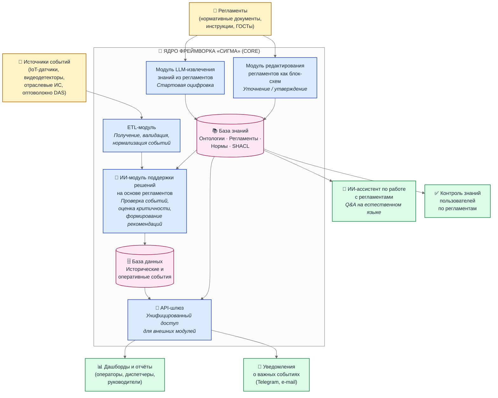
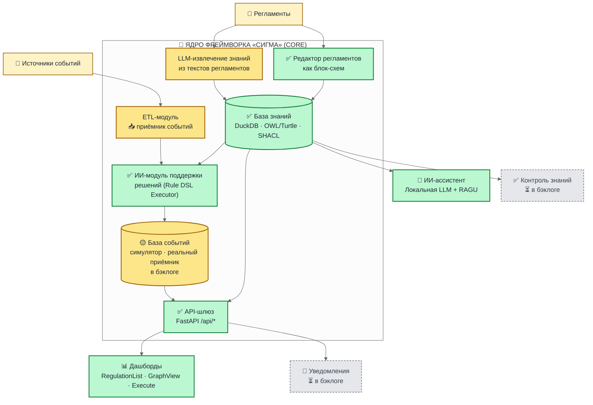

# Архитектура фреймворка «Сигма» и место RAGRAF

> Документ описывает целевую архитектуру фреймворка СИГМА (ИИ‑01‑01‑01‑1/1‑ЛУ,
> уточнённое ТЗ 2026 года) и явно фиксирует, какие компоненты ядра уже
> реализованы в RAGRAF, какие в работе, а какие — за пределами нашей зоны
> ответственности. Источник определений — ТЗ СИГМА §4.1; рисунок 1 из ТЗ.

## 1. Целевая архитектура СИГМЫ

СИГМА — это **платформенная среда** (не прикладная система), состоящая
из двух взаимосвязанных контуров:

- **Среда разработки** — SDK, контракты подключения модулей, инструменты
  для проектирования цифровых двойников, цифровых регламентов и форм
  валидации входных данных.
- **Платформенный контур исполнения** — развёрнутое CORE-ядро в
  контейнерной инфраструктуре: API‑шлюз, ETL, семантическая база
  знаний, ИИ‑модули, объектное хранилище.

CORE состоит из **минимального обязательного набора модулей**, вокруг
которого ставятся подключаемые модули (дашборды, ИИ‑ассистенты, контроль
знаний). Источники событий и текстовые регламенты — внешние входы;
дашборды, уведомления и ассистенты — внешние выходы / потребители.

### 1.1 Диаграмма (top‑down)

### 1.2 Описание блоков CORE (по ТЗ §4.1.1)

| Блок                                            | Назначение                                                                                                                         |
|-------------------------------------------------|------------------------------------------------------------------------------------------------------------------------------------|
| **ETL-модуль**                                  | Приём событий из внешних источников через адаптеры, валидация формата, нормализация в стандартные JSON-схемы, маршрутизация в ядро. |
| **Модуль LLM-извлечения знаний**                | Автоматическая оцифровка текстовых регламентов: выделение сущностей, условий, порогов, действий → формирование первичных правил.    |
| **Модуль редактирования регламентов как блок-схем** | Визуальный редактор для уточнения и утверждения цифровых регламентов аналитиком; трансляция в RDF/OWL/SHACL.                         |
| **ИИ-модуль поддержки решений**                 | На каждое событие: проверка против регламентов, оценка критичности, формирование списка предписанных действий и предзаполненных документов. |
| **База знаний** (RDF/OWL/SHACL)                  | Онтологии городской инфраструктуры, цифровые регламенты с привязкой к источнику + периоду действия, история версий правил.          |
| **База данных событий**                          | Хранение исходных и обогащённых событий + результатов обработки для оперативного и исторического анализа.                          |
| **API-шлюз**                                    | Единая точка доступа для дашбордов, ИИ-ассистентов, BI-систем; webhook-механизмы, разграничение доступа.                            |

### 1.3 Внешние интерфейсы (по ТЗ §4.1.2)

- Адаптеры источников событий — IoT, камеры, теплосети, мониторинг
  экологии. Все источники приводят данные к единому формату событий.
- Подписка на события и уведомления через webhook'и и очереди.
- Сервисы работы с базой знаний — поиск регламентов, получение
  структурированных правил, проверка соответствия событий.
- Все интеграции проходят через единую систему аутентификации/авторизации.

---

## 2. Место RAGRAF на этой архитектуре

RAGRAF — это **наша часть CORE Сигмы**, реализующая «авторский» контур
(Author / Model Layers): редактор регламентов, базу знаний, симулятор
исполнения, библиотеку датчиков. Боевой ETL-приёмник от реальных
источников и production-runtime — в работе.

### 2.1 Карта покрытия

Легенда:
- 🟢 **Зелёный** — полностью реализовано в RAGRAF.
- 🟡 **Жёлтый** — частичная реализация (есть симулятор / основа, требуется продакшн-расширение).
- ⬜ **Серый пунктир** — в бэклоге, ждёт прикладного контекста.

### 2.2 Соответствие модулей СИГМЫ ↔ компонентов RAGRAF

| Модуль СИГМЫ (по ТЗ §4.1)                       | Покрытие в RAGRAF                                                                                                                                                                              | Статус |
|-------------------------------------------------|-----------------------------------------------------------------------------------------------------------------------------------------------------------------------------------------------|--------|
| **ETL-модуль**                                   | `POST /api/regulations/{sid}/execute` принимает SensorReadings от симулятора; библиотека подтипов датчиков (`/sensors`) описывает payload-форматы; **боевой `/api/events/ingest` — в бэклоге**. | 🟡     |
| **LLM-извлечение знаний из регламентов**         | Rules-based извлечение `/api/sandbox/extract-parameters` + редактируемый словарь терминов `/api/extraction-terms` (DuckDB, predicted_domain). **Полноценная LLM-оцифровка через RAGU — частично**, требует production-grade pipeline. | 🟡     |
| **Редактор регламентов как блок-схем**           | Rule DSL Flow Editor (React Flow): `/regulations/{id}/flow` с 8 типами узлов, версионирование, валидация. Полностью соответствует ТЗ §4.2.4 п.2.                                              | ✅     |
| **ИИ-модуль поддержки решений на основе регламентов** | `flow_executor.py` — интерпретатор Rule DSL: на вход readings → выход `{level, recommendation, fired_nodes, trace}`. Поддержка трёх стратегий привязки (sensor_id / param_id / sensor_type).   | ✅     |
| **База знаний** (онтологии · регламенты · нормы) | DuckDB-backed: 8 регламентов в seed, SHACL-формы валидации, история версий, PROV-O привязка к нормативным документам (`source_document`, `source_clause`, `valid_from/to`).                    | ✅     |
| **База данных событий**                          | Trace симулятора возвращается inline в execute-ответе; **отдельной таблицы `events` для журнала срабатываний пока нет** — в бэклоге §«Приёмник событий СИГМЫ».                                  | 🟡     |
| **API-шлюз**                                     | FastAPI на `/api/*` — 53 endpoint'а (Swagger UI: `/docs`). Покрытие тестами: 155 pytest, в т.ч. `test_coverage_gaps.py`.                                                                       | ✅     |
| **Дашборды и отчёты**                            | `/regulations` (карточки), `/graph` (Cytoscape карта связей), `/execute` (status-grid + симулятор), `/sensors` (CRUD библиотеки датчиков).                                                     | ✅     |
| **Уведомления о важных событиях** (Telegram/e-mail) | Не реализовано — в бэклоге §4.2.1 ТЗ Сигмы. RAGRAF возвращает `level + recommendation`, рассылка делегируется внешнему сервису.                                                                  | ⏳     |
| **ИИ-ассистент по работе с регламентами**        | «Локальная LLM» (Ollama qwen2.5) + RAGU retrieval поверх корпуса регламентов: `/sandbox` чат, override промптов в RAGU Studio.                                                                  | ✅     |
| **Контроль знаний пользователей** (тесты по регламентам) | Не реализовано — в бэклоге.                                                                                                                                                                  | ⏳     |
| **Прогнозирование и моделирование**              | Симулятор исполнения (`/execute`) — внутренний sandbox для дизайнера. Внешние прогнозные модули подключаются как «спрогнозированные события» через тот же ETL-контракт; интеграции с конкретными моделями — в работе. | 🟡     |

### 2.3 Что RAGRAF берёт на себя и что — нет

**Берёт на себя** (наш scope):
- Author Layer: создание и редактирование цифровых регламентов
  (визуальный flow + параметры + SHACL).
- Model Layer: хранение регламентов с привязкой к нормативной базе,
  версионирование, экспорт SIGMA-bundle для round-trip.
- Симулятор Execute: прогон регламента с тестовыми payload'ами,
  подсветка пути, вердикт `{level, recommendation}`.
- Библиотека датчиков как контракт между внешними источниками
  и регламентами (22 подтипа из ORM продакшн-видеодетекторов и DAS,
  282 поля payload, редактируемые из UI).
- Rules-based извлечение параметров из текста + dictionary-CRUD
  для «дообучения» движка.
- Локальный ИИ-ассистент (Ollama + RAGU) для работы с корпусом.

**Не берёт на себя** (внешние сервисы СИГМЫ):
- Production ETL-приёмник от реальных источников
  (`POST /api/v1/sources/{uuid}/events/`) — это endpoint самой СИГМЫ
  на серверах вне НГУ. RAGRAF может зеркалить контракт как
  `/api/events/ingest`, но это в бэклоге.
- Telegram/e-mail-рассылка — делегируется внешнему notification service.
- Контроль знаний / тесты — отдельная HR-подсистема.
- BI-аналитика «руководительского уровня» (мэрский дашборд по
  городу) — отдельная BI-система с подключением к API-шлюзу СИГМЫ.

---

## 3. Связь с другими документами

| Документ                                          | Что описывает                                                       |
|---------------------------------------------------|---------------------------------------------------------------------|
| [ARC.md](ARC.md)                                  | Полная архитектура RAGRAF (DuckDB-таблицы, lifecycle, Author/Execute split, ИИ-стек, SIGMA-bundle export, расширение под подтипы датчиков и dictionary). |
| [TZ_RAGRAF.md](TZ_RAGRAF.md)                      | Техническое задание RAGRAF по ГОСТ-19 (наша интерпретация ТЗ СИГМА в скоупе одного компонента — Author/Model Layers). |
| [README.md](README.md)                            | Запуск, проверка зависимостей, типовые сценарии (создать регламент / симулировать / прогнать через UI). |
| [BACKLOG.md](BACKLOG.md)                          | Дорожная карта: §«Event-driven execution», §«Приёмник событий СИГМЫ», §«Граф связей × Библиотека датчиков», §«Author/Execute split». |
| [event-data-examples/](event-data-examples/)      | Контракт событий СИГМЫ (JSON Schema + snapshot 503 событий с боевого endpoint'а + библиотека по типам датчиков). |
| [TZ_SIGMA 2026 (PDF)](.)                          | Целевое ТЗ фреймворка СИГМА, 33 листа, утверждено НГУ-2026. Источник определений для этой схемы. |

---

## 4. Стадии и этапы (по ТЗ §7)

В 2026 году СИГМА переходит от MVP к пилоту на наукограде Кольцово
(подсистемы: теплосети, дорожные камеры, шум, качество воздуха).
Параллельно идёт реализация модулей CORE — высокий приоритет до
сентября 2026, низкий до декабря.

Связь с RAGRAF: модули **«Редактор регламентов как блок-схем»** (срок
июнь), **«ИИ-модуль поддержки решений 1-этап»** (апрель), **«ИИ-ассистент
1-этап»** (июль), **«Проверка знаний»** (август), **«Прогнозирование
1-этап»** (сентябрь) частично уже реализованы в RAGRAF и могут быть
переиспользованы — это и есть платформенный эффект (см. ТЗ §6
«Технико-экономические показатели»).

---

> Документ обновляется параллельно с эволюцией ТЗ СИГМЫ и состояния
> RAGRAF. При значимых изменениях архитектуры — синхронизировать с
> [ARC.md](ARC.md) §16.4–§16.6 и [BACKLOG.md](BACKLOG.md).
