# ARC.md — Архитектура системы RAGRAF

> **RAGRAF** · *Regulation Authoring with Graph-RAG, Author Framework*
> Рабочая станция аналитика-методолога для оцифровки нормативных актов
> в машиноисполняемые цифровые регламенты. Компонент «среды разработки»
> фреймворка СИГМА (НГУ ЦИИ).
>
> **Версия документа:** 1.0 · **Дата:** 2026-05-15
> **Статус:** active · **Запуск:** локально (single-user)

[]()
[]()
[]()
[]()
[]()
[]()

---

## 📑 Оглавление

1. [Обзор системы](#1-обзор-системы)
2. [Слоистая архитектура](#2-слоистая-архитектура)
3. [Author / Model / Execute split](#3-author--model--execute-split)
4. [Доменная модель](#4-доменная-модель)
5. [Жизненный цикл регламента](#5-жизненный-цикл-регламента)
6. [Rule DSL Flow — визуальный редактор логики](#6-rule-dsl-flow--визуальный-редактор-логики)
7. [ИИ-стек: Ollama + RAGU](#7-ии-стек-ollama--ragu)
8. [Извлечение параметров из текста](#8-извлечение-параметров-из-текста)
9. [Версионирование и история правок](#9-версионирование-и-история-правок)
10. [Хранилище данных](#10-хранилище-данных)
11. [API-контракт](#11-api-контракт)
12. [Деплой и инфраструктура](#12-деплой-и-инфраструктура)
13. [Метрики проекта](#13-метрики-проекта)
14. [Тестовая стратегия](#14-тестовая-стратегия)
15. [ADR — принятые архитектурные решения](#15-adr--принятые-архитектурные-решения)
16. [Дальнейшее развитие](#16-дальнейшее-развитие)
17. [Ссылки](#17-ссылки)

---

## 1. Обзор системы

### 1.1 High-level диаграмма

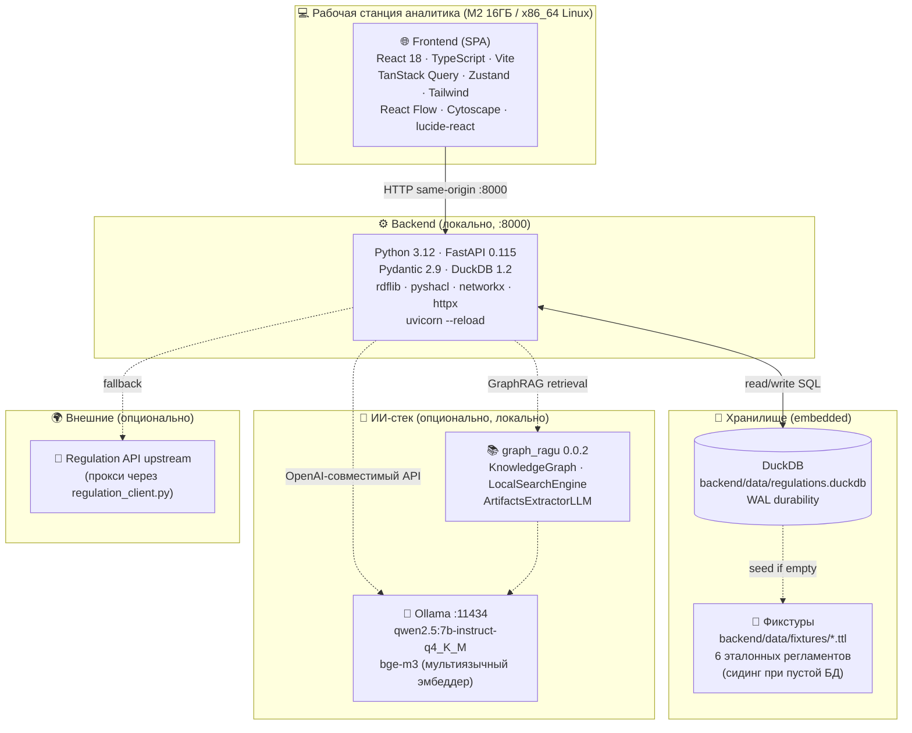

### 1.2 Ключевые свойства

| Свойство              | Значение                                              | Обоснование                                                              |
|-----------------------|-------------------------------------------------------|--------------------------------------------------------------------------|
| **Local-first**       | Запуск одной командой на ноутбуке; нет облака         | Среда разработки СИГМА §1; pilot demo без поднятия Postgres/K8s/MinIO     |
| **Single-user**       | Один аналитик-методолог, нет concurrent writes        | DuckDB single-writer; multi-user не входит в роль 4.3.1 ТЗ СИГМА          |
| **Embedded storage**  | DuckDB файл, без сервера БД                           | OLAP-оптимизация под read-heavy редактор; миграция на Postgres документирована (см. §10.4) |
| **Optional LLM**      | Без Ollama / RAGU функциональность не блокируется     | Graceful fallback: regex для extract, TF-IDF для search, шаблонный chat   |
| **Type-safe domain**  | Pydantic 2 backend ↔ TypeScript interfaces frontend   | Единая Regulation-модель через `frontend/src/lib/api.ts`                  |
| **Sigma-clean**       | Все правки CST-проверяются `sigma-audit`              | Нулевая когнитивная сложность в hot paths; см. ADR-008                    |

### 1.3 Что система НЕ делает

- ❌ Не исполняет регламенты в runtime (Execute Layer — out of scope, реализуется ядром СИГМА).
- ❌ Не принимает события из городских подсистем (ETL — функция платформенного контура).
- ❌ Не отправляет уведомления в Telegram / email (реализуется ядром СИГМА §4.2.1).
- ❌ Не хранит дашборды диспетчера и руководителя (роли 4.3.2 / 4.3.3 ТЗ СИГМА — out of scope).
- ❌ Не работает с облачными LLM-API (только локальная Ollama; см. ADR-005).
- ❌ Не поддерживает concurrent multi-user (см. условия миграции — §10.4).

---

## 2. Слоистая архитектура

### 2.1 Backend (Python · FastAPI · DuckDB)

```mermaid
flowchart TB
  subgraph ENTRY["🚪 Точка входа"]
    MAIN["app/main.py<br>FastAPI · CORS · lifespan<br>init_db (seed if empty)<br>Mount routers"]
  end

  subgraph ROUTERS["📡 API routers · app/api/*.py · 9 модулей"]
    R1["regulations.py<br>/regulations CRUD + raw + history + diff + restore + publish + archive + delete"]
    R2["datasets.py<br>/datasets (прокси на regulation_client)"]
    R3["flow.py · versions.py<br>/flow/{id} · /flow/{id}/validate · /flow/{id}/history · /flow/{id}/restore"]
    R4["shacl.py<br>/constraints/{id} GET/PUT + /constraints/{id}/shapes import/export"]
    R5["graph.py<br>/graph/{domain?} (Cytoscape payload)"]
    R6["sandbox.py<br>/sandbox/status · /chat · /search · /extract-parameters · /create-from-params · /llm-info"]
    R7["search.py · validate.py<br>(вспомогательные эндпоинты)"]
  end

  SCHEMAS["📦 Schemas · app/schemas/domain.py (Pydantic v2)<br>Regulation · Parameter · Constraint · Recommendation<br>RuleDSL · FlowNode · FlowEdge<br>FlowVersion · CyNode · CyEdge · GraphPayload<br>SearchRequest/Response · ValidationError/Result"]

  subgraph SERVICES["🔧 Services · app/services/*.py · 11 модулей"]
    S1["regulation_store.py<br>DuckDB CRUD + history snapshots<br>+ RLock для reentrant save"]
    S2["regulation_client.py<br>Прокси на upstream API<br>(fallback на store)"]
    S3["regulation_diff.py<br>Структурный diff между snapshot-ами<br>(changed/added/removed)"]
    S4["flow_storage.py<br>RuleDSL JSON в отдельной таблице<br>+ history versions"]
    S5["sandbox.py<br>extract_parameters (regex + 3-tier naming)<br>+ semantic_search (TF-IDF fallback)<br>+ chat (LLM-grounded ответ)"]
    S6["embedding_index.py<br>In-memory bge-m3 индекс<br>+ batched rebuild (sigma-audit P8)"]
    S7["ragu_service.py<br>graph_ragu обёртка<br>(KnowledgeGraph + LocalSearchEngine)"]
    S8["turtle_bridge.py<br>Regulation ↔ Turtle ↔ SHACL<br>(rdflib + pyshacl)"]
    S9["validator.py<br>Rule DSL валидация<br>(connected components, paramRef, циклы)"]
    S10["graph_builder.py<br>Сборка Cytoscape-графа из корпуса<br>(networkx)"]
    S11["templates.py · fixtures.py<br>Шаблоны для create-from-params<br>+ seed данные из Turtle"]
  end

  subgraph LOWER["💾 Низкоуровневое"]
    DB[("DuckDB<br>regulations · parameters<br>regulation_history · flow_versions")]
    CFG["⚙ config.py · pydantic-settings<br>RAGU_ENABLED · RAGU_LLM_MODEL<br>OPENAI_BASE_URL · USE_FIXTURES"]
    ADAPT["🔌 adapters/cytoscape_adapter.py<br>Regulation → CyNode/CyEdge"]
  end

  MAIN --> ROUTERS
  ROUTERS --> SCHEMAS
  ROUTERS --> SERVICES
  SCHEMAS --> SERVICES
  SERVICES --> DB
  SERVICES --> ADAPT
  SERVICES --> CFG
```

**Правило слоёв:** стрелки зависимостей идут только **вниз**. Routers зовут services; services пишут в DuckDB через `regulation_store`. Любая бизнес-логика, которая нужна в нескольких routers, выносится в `services/` или `adapters/` — никогда напрямую из роутера в DuckDB.

### 2.2 Frontend (React 18 · TypeScript · TanStack Query · Zustand)

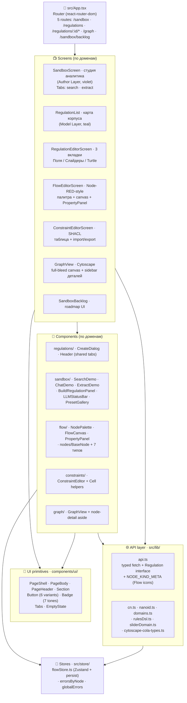

**Правило компонентов:** screens живут в `src/components/<domain>/<Screen>.tsx`, primitives — в `src/components/ui/`. Никакого прямого `bg-violet-*` / `bg-stone-*` в продуктовом коде — только через `<Button>` / `<Badge>` / семантические Tailwind-токены (см. [DESIGN_SYSTEM.md](frontend/DESIGN_SYSTEM.md)).

### 2.3 Стратегия мутаций: react-query + optimistic в Flow Editor

Большинство мутаций RAGRAF идут через стандартный `useMutation({ mutationFn, onSuccess: invalidate })` — нет облака между UI и backend, RTT 1–5 мс по localhost, perceived latency и так нулевая. Optimistic updates применяются **точечно**, только там где локальный state в react-flow или редакторе:

- **Flow Editor** ([FlowEditorScreen.tsx](frontend/src/components/flow/FlowEditorScreen.tsx)) — узлы/рёбра живут в локальном `useState`, save идёт всем DSL в `POST /flow/{id}`. Между правкой и сохранением аналитик видит результат мгновенно; refetch на success обновляет `last_saved_version_id` в HistoryPanel.
- **Regulation Form** ([RegulationEditorScreen.tsx](frontend/src/components/regulations/RegulationEditorScreen.tsx)) — draft хранится в локальной копии `Regulation`, dirty-tracking через сравнение JSON. Save отправляет весь draft; на success — invalidate `['regulation', id]` + `['regulation-history', id]` + `['datasets']`.

**Когда NOT optimistic:** для создания / удаления (DELETE регламента, POST новой версии Flow) — стандартный flow `mutate → wait → invalidate → refetch`, потому что эти операции структурно меняют список и optimistic-вставка с временным UUID не окупается на single-user-нагрузке.

---

## 3. Author / Model / Execute split

Архитектурная программа RAGRAF (см. [BACKLOG.md § Author/Execute split](BACKLOG.md)) — разделение функциональности на три слоя по типу обработки и стоимости:

```mermaid
flowchart LR
  subgraph AUTHOR["🟪 Author Layer · violet #6B46C1"]
    A1["Студия аналитика /sandbox<br>· Диалог с RAGU (chat)<br>· Извлечь параметры<br>· Семантический поиск"]
    A2["LLM-инфраструктура<br>· Ollama qwen2.5:7b<br>· bge-m3 эмбеддер<br>· graph_ragu LocalSearchEngine"]
  end

  subgraph MODEL["🟢 Model Layer · teal #2C7A7B"]
    M1["Регламенты /regulations<br>· Поля/Слайдеры/Turtle<br>· Flow Editor (Rule DSL)<br>· SHACL Constraints<br>· Граф связей"]
    M2["Хранилище<br>· DuckDB (Pydantic-домен)<br>· Turtle/SHACL/JSON export<br>· История версий + diff"]
  end

  subgraph EXECUTE["🔵 Execute Layer · blue #3182CE"]
    E1["Симулятор события<br>(out of scope — заглушка)"]
    E2["Sensor binding · API actions<br>(планируется в SIGMA-compliance backlog)"]
    E3["Журнал срабатываний<br>(реализуется ядром СИГМА)"]
  end

  AUTHOR -->|"Производит<br>(редко, дорого)"| MODEL
  MODEL -.->|"Потребляется<br>(часто, дёшево)"| EXECUTE

  style AUTHOR fill:#F3E8FF,stroke:#6B46C1
  style MODEL fill:#E6FFFA,stroke:#2C7A7B
  style EXECUTE fill:#EBF8FF,stroke:#3182CE
```

**Семантика разделения:**

| Аспект                  | Author Layer                              | Model Layer                              | Execute Layer                    |
|-------------------------|-------------------------------------------|------------------------------------------|----------------------------------|
| **Кто использует**      | Аналитик-методолог                        | Аналитик + (в будущем) оператор          | Runtime СИГМА                    |
| **Частота**             | Редко (создание/обновление регламента)    | Часто (просмотр/правка)                  | На каждое событие                |
| **Стоимость одной операции** | ~30 с (LLM-инференция)                | ~1–10 мс (DuckDB read/write)             | ~10 мс (детерминированный матч)  |
| **Технологии**          | Ollama · qwen2.5:7b · bge-m3 · RAGU       | DuckDB · Pydantic · rdflib · React Flow  | (планируется) асинхронный matcher |
| **Цвет UI**             | violet `#6B46C1`                          | teal `#2C7A7B` (primary)                 | blue `#3182CE`                   |
| **Что в RAGRAF**        | ✅ Реализовано                            | ✅ Реализовано                           | ⚠ Заглушка                       |

Подробнее — [BACKLOG.md → Phase 3 · Execute Layer](BACKLOG.md).

---

## 4. Доменная модель

### 4.1 Сущности и их связи

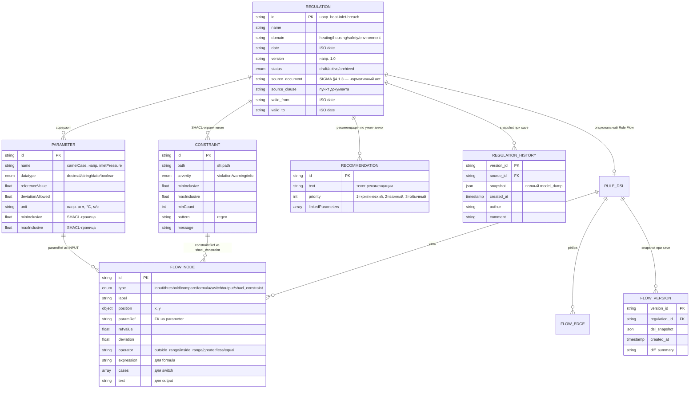

### 4.2 Таблицы DuckDB

| Таблица                | Назначение                                                | Ключевые поля                                                              |
|------------------------|-----------------------------------------------------------|----------------------------------------------------------------------------|
| `regulations`          | Карточка регламента (head-таблица)                        | `source_id` PK · `name` · `domain` · `version` · `status` · `recommendation` · `recommendation_priority` · **`source_document`** · **`source_clause`** · **`valid_from`** · **`valid_to`** |
| `parameters`           | Параметры регламента (1:N)                                | `(source_id, id)` PK · `name` · `datatype` · `ref_value` · `deviation` · `unit` · `min_inclusive` · `max_inclusive` · `position` |
| `regulation_history`   | Snapshot-ы при каждом save (полный JSON)                  | `version_id` PK · `source_id` FK · `snapshot` (JSON) · `created_at` · `author` · `comment` |
| `flow_versions`        | История Rule DSL Flow                                     | `version_id` PK · `regulation_id` FK · `dsl_snapshot` (JSON) · `diff_summary` |

**Constraints** (SHACL-ограничения) хранятся не отдельной таблицей, а как Turtle-документ через upstream `regulation_client.constraints_turtle()` или локально через rdflib — это сохраняет round-trip совместимость с внешними SHACL-валидаторами. Парсинг — `parse_shapes_turtle()` в `turtle_bridge.py`.

**Static catalogs (в коде, не в БД):**

| Где                                              | Что                                                                          |
|--------------------------------------------------|------------------------------------------------------------------------------|
| `backend/app/services/sandbox.py · CONTEXT_NAMES`| 30+ стемов русского → camelCase имя параметра (для extract)                  |
| `backend/app/services/sandbox.py · KNOWN_UNITS`  | 15 единиц измерения (атм, °C, м/с, мкг/м³, %, ч, мин, …)                     |
| `backend/data/fixtures/*.ttl`                    | 6 эталонных регламентов (теплоснабжение, ЖКХ, безопасность, экология) — seed |
| `frontend/src/lib/api.ts · NODE_KIND_META`       | 7 типов узлов Rule DSL Flow + lucide-иконки                                  |
| `frontend/src/lib/domains.ts`                    | Цветовое кодирование доменов на карточках регламентов                        |

### 4.3 Enum'ы

| Enum                  | Значения                                                                          | Где определён                  |
|-----------------------|-----------------------------------------------------------------------------------|--------------------------------|
| `RegulationStatus`    | `draft` · `active` · `archived`                                                   | `schemas/domain.py`            |
| `ParameterDatatype`   | `decimal` · `string` · `date` · `boolean`                                         | `schemas/domain.py`            |
| `ConstraintSeverity`  | `violation` · `warning` · `info` (UI-тоны: rose / amber / sky)                    | `schemas/domain.py`            |
| `NodeKind`            | `input` · `threshold` · `compare` · `formula` · `switch` · `output` · `shacl_constraint` | `schemas/domain.py`      |
| `RecommendationPriority` | `1` · `2` · `3` (UI: critical / important / normal)                            | `schemas/domain.py`            |
| Domain (slug)         | `heating` · `housing` · `safety` · `environment` (+ extras)                       | `regulation_client.list_domains` |

---

## 5. Жизненный цикл регламента

### 5.1 Статусы регламента

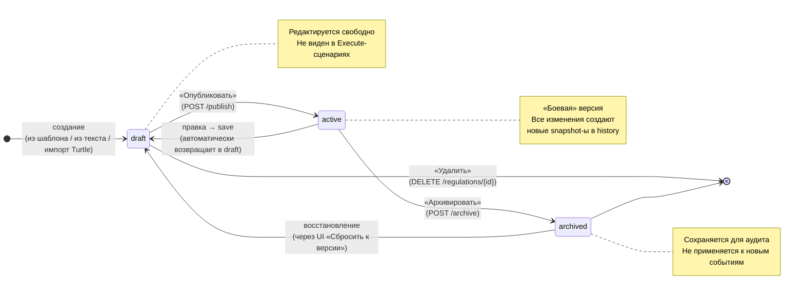

### 5.2 История версий

Каждый `POST /regulations/{id}` (save) создаёт новую запись в `regulation_history` с полным JSON-snapshot регламента (Pydantic `model_dump`). Snapshot-ы образуют непрерывную цепочку от seed-версии до текущей.

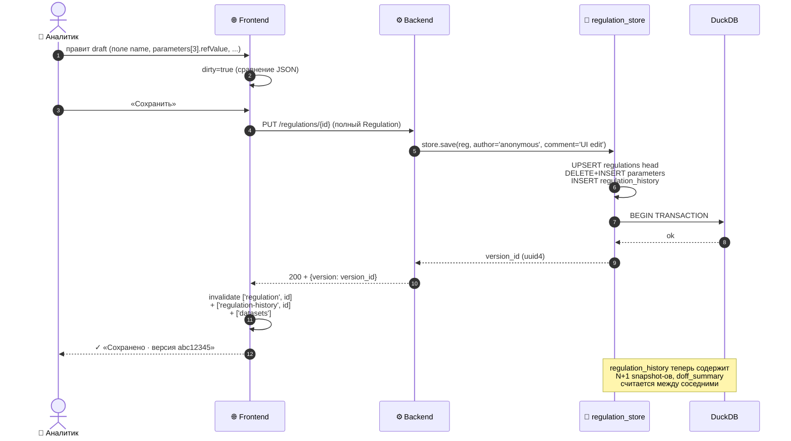

**Diff между версиями** ([regulation_diff.py](backend/app/services/regulation_diff.py)) — структурное сравнение двух snapshot-ов с группировкой изменений по типам:

| Тип изменения | Семантика                                        | UI-индикатор          |
|---------------|--------------------------------------------------|-----------------------|
| `changed`     | Поле существовало, значение изменилось           | `~ before → after` (синяя плашка) |
| `added`       | Новый параметр / constraint / recommendation     | `+ value` (emerald)   |
| `removed`     | Существующий элемент удалён                      | `− value` (rose)      |
| `initial`     | Первая версия (seed) — не с чем сравнивать       | Бейдж «seed» (emerald) |

История + diff отображаются в `HistoryPanel` (правая колонка `RegulationEditorScreen`), любую версию можно восстановить кнопкой «Восстановить».

---

## 6. Rule DSL Flow — визуальный редактор логики

### 6.1 7 типов узлов

Визуальный редактор реализован на React Flow ([FlowEditorScreen.tsx](frontend/src/components/flow/FlowEditorScreen.tsx)). Палитра слева содержит 7 типов узлов, сгруппированных по семантике (Вход / Логика / Выход / Ограничения).

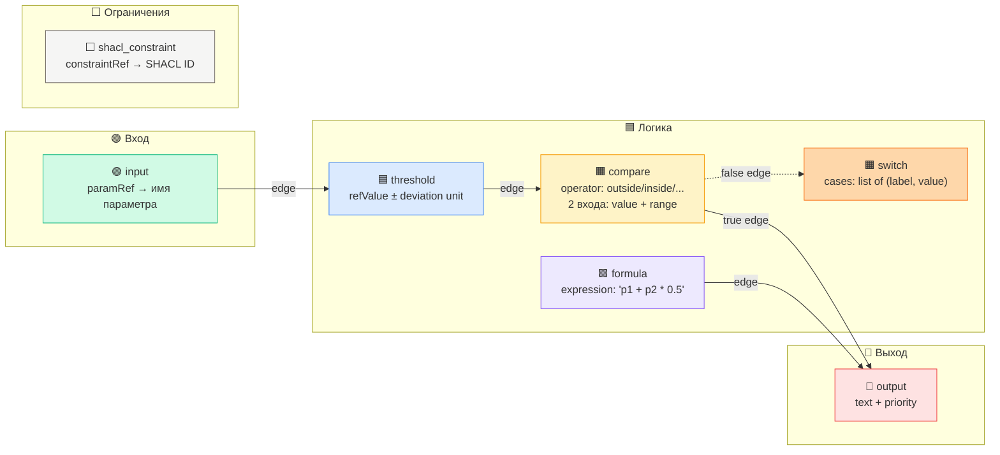

Визуальный паттерн — **Node-RED-style icon-pill** ([styles.css → .rf-node](frontend/src/styles.css)): цветная icon-секция слева (lucide-иконка типа узла) + светлый body с тип-меткой uppercase-капителью. Полное имя и детали — в правой `<PropertyPanel>` (сворачиваемой как в Node-RED).

### 6.2 Валидация Rule DSL

Перед сохранением Flow проходит проверки в [validator.py](backend/app/services/validator.py):

| Код ошибки           | Что проверяет                                                   |
|----------------------|-----------------------------------------------------------------|
| `unknown_param_ref`  | `input.paramRef` указывает на несуществующий параметр регламента |
| `unknown_constraint` | `shacl_constraint.constraintRef` указывает на отсутствующий SHACL |
| `disconnected_node`  | Узел не имеет ни входящих, ни исходящих рёбер                   |
| `cycle_detected`     | Граф содержит цикл (NetworkX `simple_cycles`)                   |
| `compare_missing_input` | У compare-узла отсутствует один из обязательных входов (`value` / `range`) |

Результат валидации возвращается через `POST /flow/{id}/validate`, ошибки попадают в `useFlowStore.errorsByNode` (Zustand) и подсвечиваются красной рамкой на canvas + tooltip с сообщением.

### 6.3 Трансляция Flow ↔ DSL

```mermaid
flowchart LR
  REACT["🎨 React Flow state<br>nodes: Node[]<br>edges: Edge[]<br>+ UI metadata (position, selected)"]
  DSL["📜 RuleDSL<br>rule_id · regulation_id<br>nodes: FlowNode[]<br>edges: FlowEdge[]"]
  JSON["💾 JSON snapshot<br>в flow_versions.dsl_snapshot"]

  REACT -->|flowToDsl<br>(rulesDsl.ts)| DSL
  DSL -->|dslToFlow<br>(rulesDsl.ts)| REACT
  DSL -.->|model_dump| JSON
  JSON -.->|model_validate| DSL
```

Помощники `flowToDsl` / `dslToFlow` живут в [frontend/src/lib/rulesDsl.ts](frontend/src/lib/rulesDsl.ts) и покрыты юнит-тестами (9 кейсов в `rulesDsl.test.ts`).

---

## 7. ИИ-стек: Ollama + RAGU

### 7.1 Локальная инференция (без облака)

```mermaid
flowchart LR
  subgraph LOCAL["💻 Локальная машина"]
    UI["🌐 Frontend<br>SandboxScreen → ChatDemo"]
    BE["⚙ Backend · /sandbox/chat"]
    EI["🔢 EmbeddingIndex<br>in-memory cache<br>signature-based rebuild"]
    RG["📚 RAGU LocalSearchEngine<br>(graph_ragu 0.0.2)"]
    OL["🦙 Ollama :11434<br>OpenAI-compatible API"]
  end

  UI -->|вопрос пользователя| BE
  BE -->|embed query| OL
  OL -->|qvec (1024-dim)| BE
  BE -->|cosine sim search| EI
  EI -->|top-k regulations| BE
  BE -->|chat completion<br>с retrieved-источниками| OL
  OL -->|ответ qwen2.5:7b| BE
  BE -.->|опционально| RG
  RG -.-> OL
  BE -->|сгенерированный ответ + sources| UI

  style OL fill:#FEF3C7,stroke:#F59E0B
  style RG fill:#EDE9FE,stroke:#8B5CF6
```

### 7.2 Модели и характеристики

| Компонент           | Модель                              | Размер  | Скорость на M2 Air      | Назначение                          |
|---------------------|-------------------------------------|---------|-------------------------|--------------------------------------|
| **Точная LLM** (default) | `qwen2.5:7b-instruct-q4_K_M`   | ~4.4 ГБ | ~6 tok/s, prefill ~50 tok/s | Сводки длинных документов, сравнение регламентов, follow-up'ы |
| **Быстрая LLM** (опц.)  | `qwen2.5:3b-instruct-q4_K_M`    | ~1.9 ГБ | ~13 tok/s               | Приветствия, краткие ответы, извлечение параметров, быстрая итерация |
| **Embedder**        | `bge-m3`                            | ~1.2 ГБ | ~150 tok/s, batched     | Семантический индекс, retrieval     |
| **Runtime**         | Ollama 0.23+                        | ~80 МБ  | Native Metal на Apple Silicon | OpenAI-совместимый HTTP API   |

Обе LLM — из одной семьи (qwen2.5-instruct), поэтому промпт-поведение совместимо: переключение в UI не требует переписывания системных промптов. 7b как дефолт даёт качество, 3b — скорость для коротких сценариев.

**Переключение моделей в UI** ([SandboxScreen](frontend/src/components/sandbox/SandboxScreen.tsx), секция «Модель LLM» в правой панели):
- Выбор персистится в `localStorage` ключом `ragraf:sandbox:model-kind:v1`
- Каждый `ChatRequest` несёт поле `model` — backend подставляет в OpenAI client; `None` = дефолт из `settings.ragu_llm_model`
- Если выбранная модель не установлена в Ollama, UI показывает плашку с командой `ollama pull <tag>` — обнаружение через `available_models` из `/api/sandbox/llm-info`
- Пресеты сценариев тоже могут устанавливать модель: «Краткий ответ» / «Извлечь параметры» → fast (3b); «Резюме документа» / «Сравнить регламенты» → precise (7b)

**Управление RAM**: каждая LLM-модель загружается в память Ollama при первом обращении (cold-start 10-30 сек на M2 Air), потом держится в RAM до истечения `keep_alive` (дефолт 5 мин после последнего запроса). RAGRAF даёт пользователю явный toggle:

- `POST /api/sandbox/llm/load` — Ollama `keep_alive: -1` → модель в RAM бессрочно (готова отвечать без задержек)
- `POST /api/sandbox/llm/unload` — Ollama `keep_alive: 0` → выгрузка немедленно (освободить 2-5 ГБ под другие задачи)
- Кнопка-индикатор «прогреть / в RAM» в подвале правой панели Студии, рядом со строкой `LLM:` — состояние читается из `loaded_models` в llm-info

**Где Ollama хранит модели** (см. также [README §LLM-модели](README.md#llm-модели-и-ollama)):
- macOS: `~/.ollama/models/{blobs,manifests}/`
- Linux: `/usr/share/ollama/.ollama/models/` или `~/.ollama/models/`
- Windows: `C:\Users\<user>\.ollama\models\`
- Сменить путь: `export OLLAMA_MODELS=/custom/path` перед `ollama serve`

### 7.3 EmbeddingIndex и batched rebuild

`EmbeddingIndex` ([embedding_index.py](backend/app/services/embedding_index.py)) — in-memory кэш с сигнатурой ревалидации:

- **Сигнатура** = sha256 от `(reg.id, reg.name, recommendations[].text)` всех регламентов;
- При первом обращении (или при изменении корпуса) — пересборка через **батч-эндпоинт** Ollama (`POST /v1/embeddings` с `input=[t1, t2, ...]`);
- 1 HTTP round-trip вместо N — экономия ~10 секунд на 6 регламентах (sigma-audit P8, см. ADR-007).

```python
# Один батч-вызов вместо цикла
resp = await client.embeddings.create(
    model=settings.ragu_embed_model,
    input=texts,  # список из всех непустых текстов регламентов
)
self._vectors = {rid: list(d.embedding) for rid, d in zip(ids, resp.data)}
```

### 7.4 Graceful fallback

Когда Ollama недоступна / `RAGU_ENABLED=false`:

| Функция           | Полноценный режим              | Fallback                                       |
|-------------------|--------------------------------|------------------------------------------------|
| Q&A в Sandbox     | qwen2.5 с retrieved-источниками | Шаблонный ответ со списком найденных регламентов |
| Семантический поиск | bge-m3 cosine similarity      | TF-IDF по name + recommendation                |
| Извлечение параметров | LLM-extract (опционально)  | Чистый regex + 3-tier naming                   |
| Статус-индикатор  | «🟢 RAGU подключён»             | «🟡 mock-режим»                                 |

Функциональность UI не блокируется ни на одном из путей.

---

## 8. Извлечение параметров из текста

`POST /sandbox/extract-parameters` — pipeline извлечения числовых параметров (`число ± отклонение единица`) из произвольного текста нормативного акта.

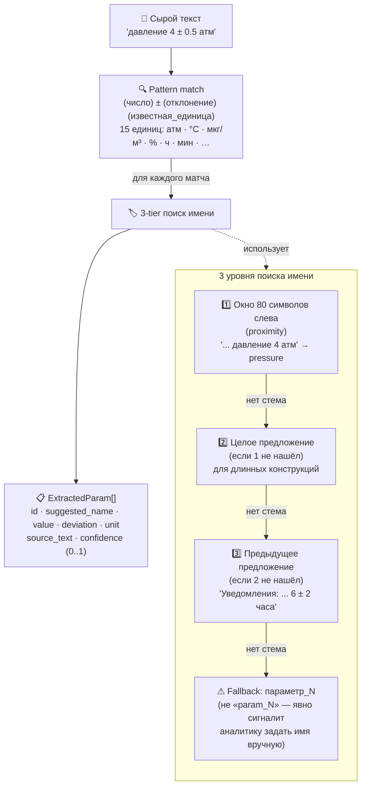

**Confidence-эвристика:**

| Ситуация                                | Confidence |
|-----------------------------------------|------------|
| Стем найден в окне 80 символов          | 0.85       |
| Стем найден на уровне предложения/абзаца | 0.85      |
| Стем не найден → русский плейсхолдер    | 0.40       |
| Есть симметричное deviation (`± N`)     | +0.10 (макс 1.0) |

Frontend в `ParamGroupCard` подсвечивает плейсхолдер `параметр_N` amber-обводкой и просит аналитика переименовать вручную перед сборкой регламента.

**Словарь стемов** (`CONTEXT_NAMES` в `sandbox.py`) — 30+ entries по 4 категориям: физические параметры (температура → temperature, давление → pressure, скорость ветра → windSpeed, …), оповещения (уведомление → notificationLeadTime, до прогноза → forecastLeadTime, …), регламенты режима (очистка → cleaningInterval, штабель → stockpileTemperature, …).

---

## 9. Версионирование и история правок

Каждый ресурс с историей хранит snapshot-ы в отдельной таблице с автоматическим diff между соседними версиями:

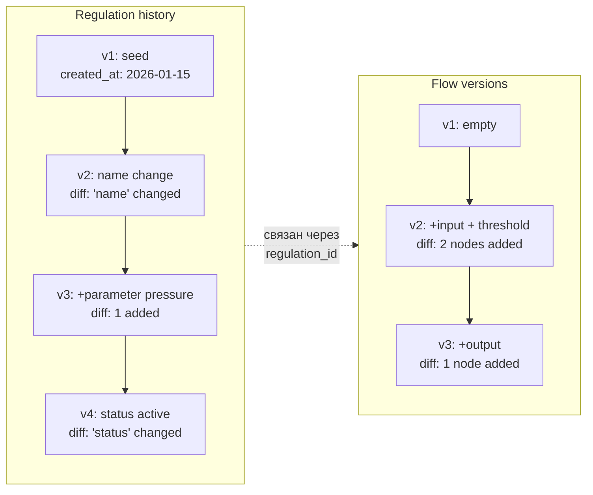

**Что хранится:**

- **`regulation_history`** — полный JSON Regulation (Pydantic `model_dump`), позволяет восстановить любую версию структурно (`POST /regulations/{id}/restore/{version_id}`).
- **`flow_versions`** — JSON Rule DSL, аналогично восстановление через `POST /flow/{id}/restore/{version_id}`.

**Diff-summary** считается lazy при запросе `GET /regulations/{id}/history`:

```python
def compute_diff(prev: dict, curr: dict) -> DiffResult:
    changes = []
    for field in _scalar_fields():
        if prev.get(field) != curr.get(field):
            changes.append({"op": "changed", "path": field, "before": prev[field], "after": curr[field]})
    # + параметры (по id), constraints, recommendations
    return DiffResult(changes=changes, counts={"changed": ..., "added": ..., "removed": ...})
```

Алгоритм покрыт 5 unit-тестами в `test_regulation_diff.py` (changed/added/removed/initial/empty).

---

## 10. Хранилище данных

### 10.1 DuckDB как authoritative store

| Свойство                | DuckDB в RAGRAF                                                |
|-------------------------|----------------------------------------------------------------|
| **Тип**                 | Embedded OLAP, single-file (`backend/data/regulations.duckdb`) |
| **Версия**              | ≥1.2.0 (требование `requirements.txt`)                         |
| **Durability**          | WAL по умолчанию, replay при следующем старте                  |
| **Schema migration**    | Идемпотентный `CREATE TABLE IF NOT EXISTS` + `ALTER TABLE ADD COLUMN` через PRAGMA introspection |
| **Concurrent writers**  | 1 (single-process, RLock в `regulation_store`)                 |
| **Concurrent readers**  | Несколько (внутри одного процесса через `_LOCK`)               |
| **Размер на 100 регламентов** | ~150 МБ (с историей и snapshot-ами)                       |
| **Тестовый профиль**    | In-memory `duckdb.connect(':memory:')` per-test через `isolated_data_dir` fixture |

### 10.2 Сидинг из фикстур

При первом старте (или после удаления `.duckdb` файла) backend через `lifespan` вызывает `regulation_store.init_db()` → `_seed_from_fixtures_if_empty()`:

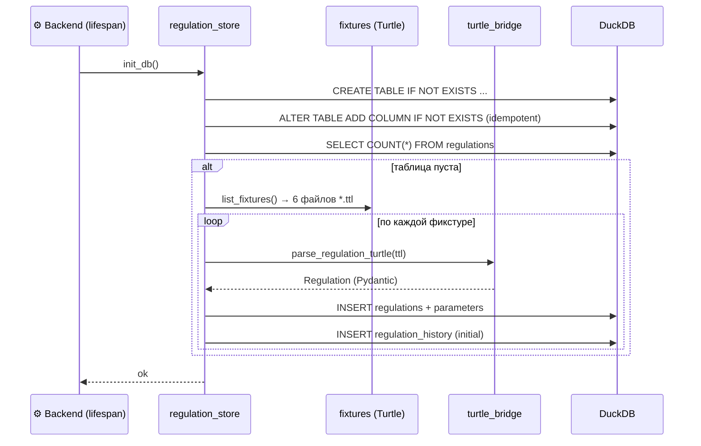

Фикстуры в `backend/data/fixtures/`:

| Файл                              | Домен          | Параметров |
|-----------------------------------|----------------|-----------|
| `pressure-diameter.ttl`           | heating        | 2         |
| `heat-inlet-breach.ttl`           | heating        | 5         |
| `roof-snow-fencing.ttl`           | housing        | 5         |
| `dormitory-flood.ttl`             | housing        | 5         |
| `thermal-incident-server.ttl`     | safety         | 5         |
| `air-quality-smog-trap.ttl`       | environment    | 5         |

### 10.3 Capacity и производительность

| Корпус                     | Размер `.duckdb` | API `list_all()` | API `get(reg)` | rebuild embedding-index |
|----------------------------|------------------|------------------|----------------|-------------------------|
| 6 фикстур (текущее)        | ~5 МБ            | 5–10 мс          | 1–3 мс         | ~30 сек (1 батч)        |
| 100 регламентов / 20 версий | ~150 МБ         | 50–100 мс        | 5–10 мс        | ~2 мин                  |
| 1000 регл. / 20 версий     | ~1.5 ГБ          | 200–500 мс       | 20–50 мс       | ~15 мин                 |
| **10000 регл. (предел)**   | **~15 ГБ**       | **0.5–2 с** ⚠   | **100–300 мс** ⚠ | **~2 ч** ⚠           |

При достижении 10к регламентов API-времена превышают целевые (раздел 4.4 ТЗ RAGRAF) — это триггер миграции на Postgres.

### 10.4 Миграция DuckDB → Postgres

Условия миграции и план шагов — подробно в [TZ_RAGRAF.md Приложение А](TZ_RAGRAF.md). Кратко — миграция запускается при:

- **≥3 одновременных пользователей** (DuckDB single-writer)
- **Деплой в продакшен** с требованиями репликации / HA
- **Multi-tenant** с row-level security
- **CDC** для стрима изменений в Kafka / индекс
- Корпус **>10 000 регламентов**

SQLite в плане миграции **отсутствует** — DuckDB строго лучше для аналитических нагрузок RAGRAF (см. ADR-006).

---

## 11. API-контракт

### 11.1 9 routers · 30+ эндпоинтов

| Группа         | Эндпоинты                                                                          |
|----------------|------------------------------------------------------------------------------------|
| **Datasets**   | `GET /datasets` (список регламентов с метриками)                                   |
| **Regulations**| `GET/POST/PUT/DELETE /regulations/{id}` · `GET /regulations/{id}/raw` (Turtle) · `GET /regulations/{id}/history` · `GET /regulations/{id}/diff/{version_id}` · `POST /regulations/{id}/restore/{version_id}` · `POST /regulations/{id}/publish` · `POST /regulations/{id}/archive` |
| **Flow**       | `GET/POST /flow/{id}` · `POST /flow/{id}/validate` · `GET /flow/{id}/history` · `POST /flow/{id}/restore/{version_id}` |
| **Constraints**| `GET/PUT /constraints/{id}` · `POST /constraints/{id}/import` (SHACL Turtle) · `GET /constraints/{id}/shapes` (export) |
| **Graph**      | `GET /graph?domain={domain}` (Cytoscape payload)                                   |
| **Sandbox**    | `GET /sandbox/status` · `GET /sandbox/llm-info` · `POST /sandbox/chat` · `POST /sandbox/search` · `POST /sandbox/extract-parameters` · `POST /sandbox/create-from-params` |
| **Search · Validate · Versions** | Вспомогательные (валидация Turtle, поиск)                        |

### 11.2 Type-safety: Pydantic ↔ TypeScript

```
1. Pydantic v2 schemas (backend/app/schemas/domain.py)
   ↓
2. FastAPI auto-generates OpenAPI 3.1 (http://localhost:8000/docs)
   ↓
3. Frontend TypeScript interfaces (frontend/src/lib/api.ts)
   - вручную поддерживаются параллельно (≤30 типов)
   - НЕ автогенерация openapi-typescript — слишком много шума
     от union'ов и lazy-loaded типов RAGU
   ↓
4. React-компоненты через типы Regulation / Parameter / FlowNode
   получают компайл-тайм проверки
```

ADR-009: явная TypeScript-модель vs автогенерация — выбран явный вариант, потому что корпус из 30 типов читается лучше чем 1500-строчный `types.gen.ts`.

### 11.3 Swagger / OpenAPI

FastAPI по дефолту монтирует три эндпоинта:

| Путь            | Что отдаёт                                              |
|-----------------|---------------------------------------------------------|
| `/docs`         | Swagger UI с группировкой по тегам и «Try it out»       |
| `/redoc`        | Альтернативный ReDoc-рендер той же спеки                |
| `/openapi.json` | Сырая OpenAPI 3.1 спецификация                          |

Доступны локально при запущенном `uvicorn` (по умолчанию http://localhost:8000/docs).

---

## 12. Деплой и инфраструктура

### 12.1 Текущий режим — локальный single-user

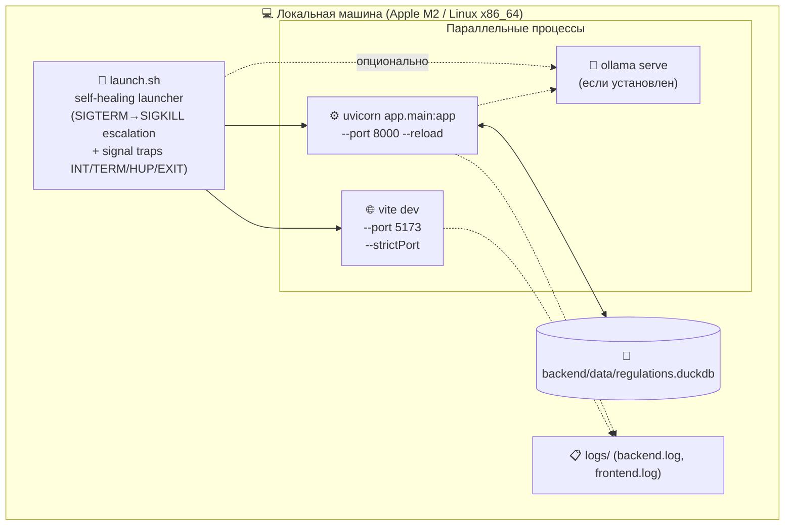

### 12.2 Запуск

```bash
# Опционально: установить и запустить Ollama (один раз)
brew install ollama
ollama pull qwen2.5:7b-instruct-q4_K_M
ollama pull bge-m3
ollama serve  # в отдельном терминале

# Backend (с автоматической миграцией DuckDB)
cd backend && source .venv/bin/activate
uvicorn app.main:app --host 127.0.0.1 --port 8000 --reload

# Frontend
cd frontend && npm install && npm run dev
```

`launch.sh` ([в корне репозитория](launch.sh)) делает это всё одной командой с self-healing-логикой: при ctrl-C каскадно завершает обе подсистемы, при сбое одной — оставляет другую работать.

### 12.3 Будущий продакшен-режим (опционально, см. §10.4)

При срабатывании триггеров миграции — переход на:

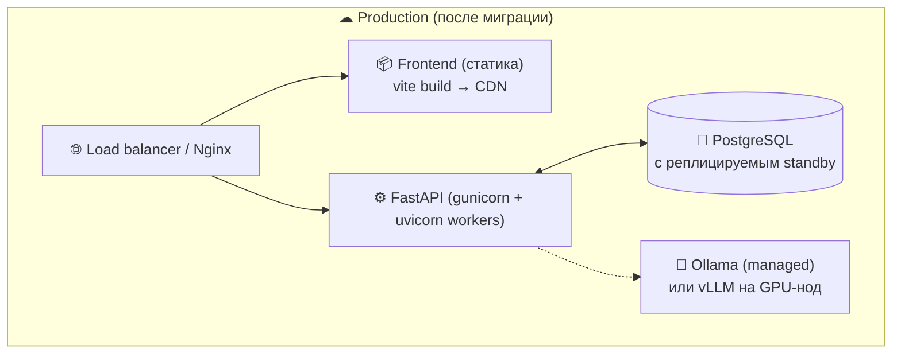

Шаги миграции — Приложение А [TZ_RAGRAF.md](TZ_RAGRAF.md), оценка 2–4 рабочих дня.

---

## 13. Метрики проекта

| Метрика                            | Значение                |
|------------------------------------|-------------------------|
| **Backend LOC** (`app/`)           | ~4 283                  |
| **Frontend LOC** (`src/`)          | ~7 113                  |
| **Backend файлов** (`*.py`)        | 30                      |
| **Frontend файлов** (`*.ts/*.tsx`) | 38                      |
| **API эндпоинтов**                 | 30+                     |
| **Доменных моделей** (Pydantic)    | 15                      |
| **Backend сервисов**               | 11                      |
| **Frontend screens**               | 7                       |
| **UI-примитивов**                  | 7 (`PageShell`, `PageHeader`, `Section`, `Button`, `Badge`, `Tabs`, `EmptyState`) |
| **Backend тестов**                 | **82 (все зелёные)**    |
| **Frontend тестов**                | **44 (все зелёные)**    |
| **Sigma-audit нарушений**          | **0** (Python codebase) |
| **TypeScript strict**              | 0 ошибок                |
| **Языков i18n**                    | 1 (русский UI)          |
| **LLM-инфраструктура**             | Локальная (Ollama)      |
| **Облачные зависимости**           | 0                       |

---

## 14. Тестовая стратегия

### 14.1 Пирамида

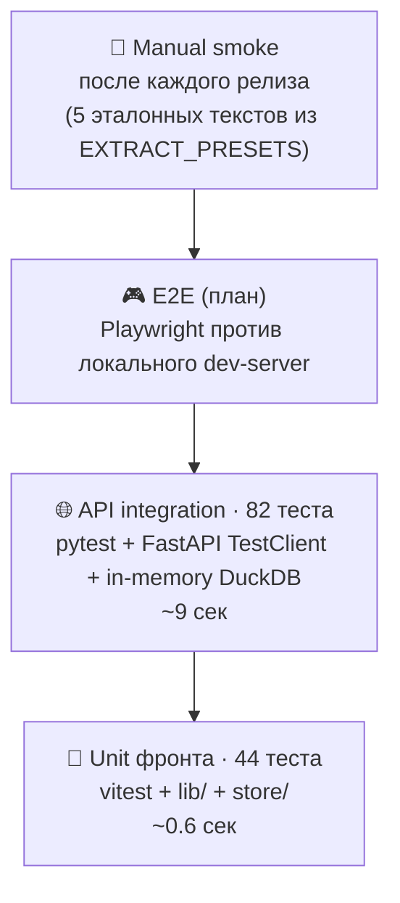

### 14.2 Покрытие по доменам

| Файл                                       | Тестов | Что покрывает                                                     |
|--------------------------------------------|--------|-------------------------------------------------------------------|
| `test_sandbox.py`                          | 19     | extract (regex + 3-tier naming) · semantic search · chat · create-from-params |
| `test_create_regulation.py`                | 12     | POST /regulations + шаблоны доменов                              |
| `test_regulation_diff.py`                  | 5      | Структурный diff между snapshot-ами                              |
| `test_regulation_store.py`                 | 8      | DuckDB CRUD + history + schema migration                         |
| `test_delete_regulation.py`                | 4      | Каскадное удаление + защита от seed-fixture                      |
| `test_turtle_bridge.py`                    | 10     | Regulation ↔ Turtle round-trip + SHACL parse/serialize           |
| `test_validator.py`                        | 8      | Rule DSL validation (unknown refs, cycles, disconnected)         |
| `test_api_endpoints.py`                    | 16     | Smoke по 9 routers                                                |

### 14.3 Frontend unit-тесты

| Файл                          | Тестов | Что покрывает                                       |
|-------------------------------|--------|-----------------------------------------------------|
| `lib/rulesDsl.test.ts`        | 9      | flowToDsl / dslToFlow round-trip                    |
| `lib/sliderDomain.test.ts`    | 26     | deriveSliderRange + fillPercent + edge cases        |
| `lib/nanoid.test.ts`          | 4      | Длина + алфавит + коллизии (1000 итераций)          |
| `lib/domains.test.ts`         | 5      | getDomainVisual + fallback                          |

### 14.4 Sigma-audit (Python static analysis)

Каждый коммит в backend проверяется через `sigma-audit audit backend/` (методология Гончарова / Нечесова / Свириденко, Sobolev Institute of Mathematics, IEEE 2024) — 26 детекторов на полиномиальную сложность и Sigma-clean конструкции. **Текущий статус: 0 violations** на 40 файлах.

Закрытые правки:
- **L74 P8** (`await_in_loop`) — embedding pipeline переведён на batched single call (1 round-trip вместо N).
- **L107 P5** (`manual_list_append`) — заменено на list comprehension.

---

## 15. ADR — принятые архитектурные решения

> Решения с обоснованием. Если приходит соблазн «передумать» — сначала прочитай среду, почему сейчас именно так.

| ADR | Решение                                                       | Почему                                                                                                |
|-----|---------------------------------------------------------------|-------------------------------------------------------------------------------------------------------|
| 001 | UUID-фрагмент в качестве version_id                           | Не предсказуем, легко генерится `uuid.uuid4().hex[:8]`, читаем для UI                                  |
| 002 | DuckDB как authoritative store (не SQLite, не Postgres)       | Single-user OLAP-нагрузка, embedded, миллисекундный отклик, PostgreSQL-совместимый SQL для миграции   |
| 003 | Single-process, single-writer (RLock на reentrant save)       | Lifespan-сидинг может вызывать save рекурсивно — `Lock` создаст deadlock, нужен `RLock`              |
| 004 | Локальная LLM через Ollama (без облака)                       | M2 16ГБ покрывает корпус до 1000 регл.; 0 руб операционных; защита от утечки нормативных данных       |
| 005 | Author / Model / Execute split с цветовыми токенами           | Camunda/Node-RED-паттерн; явно отделяет «дорогую LLM-зону» от «дешёвой структурной»                   |
| 006 | DuckDB → Postgres минуя SQLite                                | SQLite OLTP-оптимизирован, проиграет на агрегатах графа в 5–20 раз; нет JSONB; serialize lock         |
| 007 | Batched embedding rebuild (1 HTTP вместо N)                   | sigma-audit P8; Ollama батчит на сервере, экономит RTT × N для корпуса >5 регламентов                 |
| 008 | sigma-audit gate перед каждым коммитом backend                | Methodology IEEE 2024 + ГОСТ Р 56939-2024 §5.10; нулевые риски квадратичной сложности в hot path     |
| 009 | Явная TypeScript-модель (не openapi-typescript codegen)       | 30 типов поддерживать руками легче чем читать 1500-строчный auto-generated файл с lazy-имитированиями RAGU |
| 010 | Pydantic v2 + DuckDB-snapshot в history (не отдельные таблицы версий полей) | Проще откатывать целиком; меньше joins; structured diff считается at query time через regulation_diff |
| 011 | React Flow для редактора flow (не свой canvas)                | 6 КБ gzip, поддержка handles из коробки, активная community                                           |
| 012 | Cytoscape с cola-layout для графа корпуса                     | Force-directed для onthology-графов читается лучше чем dagre; cola поддерживает constraints           |
| 013 | Node-RED-style icon-pill блоки на canvas                      | Знакомый паттерн для пользователей Node-RED/n8n/Camunda Modeler; снижает порог входа                  |
| 014 | Collapsible PropertyPanel (сворачиваемая правая колонка)      | Node-RED-style inspector — full screen для canvas, развёртывается при клике на узел                   |
| 015 | sandbox.py extract: 3-tier поиск имени параметра              | Окно 80 символов даёт `param_N` для длинных предложений с ключевым словом в начале → fallback на sentence/paragraph |
| 016 | Russian-friendly fallback (`параметр_N` вместо `param_N`)     | Явно сигналит аналитику «надо переименовать» — английский литерал воспринимался как корректное имя   |
| 017 | source_document / source_clause / valid_from / valid_to       | SIGMA §4.1.3 — каждое правило связано с источником и периодом действия для аудита                     |
| 018 | Idempotent schema migration через PRAGMA introspection        | DuckDB `ALTER TABLE ADD COLUMN IF NOT EXISTS` не поддерживается во всех версиях — введён через `PRAGMA table_info` |
| 019 | Регламент как Pydantic `Regulation` (не RDF-нативный)         | Pydantic типы → TypeScript типы → React UI без round-trip через rdflib; Turtle — только export        |
| 020 | rdflib + pyshacl для Turtle/SHACL round-trip                  | Стандарт W3C; поддержка SHACL Constraints из коробки; pyshacl-валидатор бесплатно                     |
| 021 | Графический diff в HistoryPanel (rose / emerald / blue)       | added / removed / changed — мгновенно читается без сравнения JSON руками                              |
| 022 | sigma-audit gate в CI (не только лок)                         | Защита от регрессии когнитивной сложности при автоматизированных правках через LLM-агентов            |

---

## 16. Дальнейшее развитие

### 16.1 Backlog (приоритизирован)

| Phase | Что                                                                      | Сложность   |
|-------|--------------------------------------------------------------------------|-------------|
| **2** | Левый sidebar с 3 разделами (Студия / Регламенты / Исполнение)           | M (~2–3 ч)  |
| **3** | Execute Layer · симулятор события + sensor binding на INPUT + API actions на OUTPUT | L+ (неделя+) |
| **4** | Enterprise polish · status bar · Cmd-K · user menu · RBAC                | M           |
| **SIGMA-1** | ETL-модуль UI (каталог источников событий)                          | L           |
| **SIGMA-2** | Notification configurator (Telegram / email каналы)                 | M           |
| **SIGMA-3** | Карточка события / event card (для пилота с СИГМА)                  | M           |
| **SIGMA-4** | Контроль полноты оцифровки (дашборд пробелов в нормативной базе)    | M           |
| **SIGMA-5** | Тесты на знание регламентов (авто-генерация QA через LLM)           | L           |
| **SIGMA-6** | Шаблоны управленческих документов (Jinja-генерация приказа/акта)    | M           |
| **SIGMA-7** | Сценарии моделирования (виртуальное событие → все активные регламенты) | M        |
| **SIGMA-8** | Контекст решения для аудита (snapshot применённых правил)           | S           |

### 16.2 Технический долг

- ⚠ Нет E2E-тестов (Playwright). Мануальный smoke по 5 EXTRACT_PRESETS после каждого релиза.
- ⚠ Vite-bundle ~1 МБ (React Flow + Cytoscape + RAGU types) — code-splitting не настроен. Целевое: lazy-loaded routes для `/sandbox`, `/graph`, `/regulations/:id/flow`.
- ⚠ DuckDB foreign keys не enforced (без `PRAGMA foreign_keys=ON`) — компенсируется атомарными транзакциями в `regulation_store.save`.
- ⚠ Frontend TypeScript-модель Regulation поддерживается руками — при росте >50 типов нужно перейти на openapi-typescript.

---

## 17. Ссылки

| Документ                                          | Содержание                                                  |
|---------------------------------------------------|-------------------------------------------------------------|
| [README.md](README.md)                            | Запуск, проверка зависимостей, типовые сценарии             |
| [TZ_RAGRAF.md](TZ_RAGRAF.md)                      | Техническое задание по ГОСТ-19 (623 строки)                 |
| [BACKLOG.md](BACKLOG.md)                          | Дорожная карта · Author/Execute split · SIGMA-compliance    |
| [DESIGN_SYSTEM.md](frontend/DESIGN_SYSTEM.md)     | UI-конвенции, примитивы, цветовые токены                    |
| Swagger UI (live)                                 | http://localhost:8000/docs (при запущенном backend)         |
| OpenAPI JSON (live)                               | http://localhost:8000/openapi.json                          |

---

> *Документ создан 2026-05-15. Поддерживается параллельно с кодом.*
> *При значимых изменениях архитектуры — обновлять одновременно с PR.*
